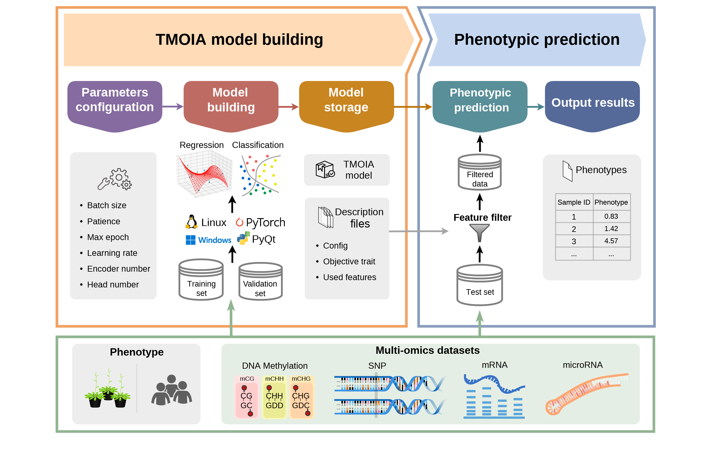

# TMOIA-GUI

The graphical user interface for **TMOIA**, a transformer-based multiomics integrative analysis approach for the phenotypic prediction and functional gene mining of complex traits.
It is an open-source software that can run on Linux and Microsoft Windows. It is free for non-commercial users.

For more details, please check out our [publication]().



TMOIA-GUI provide two main functions:
+ For **TMOIA model construction**, it takes the multi-omics data and phenotypic data as inputs. Both classification and regression tasks can be performed.
+ For **phenotypic prediction**, it takes trained model and omics feature data of new samples as inputs and returns the predicted phenotypic values.

## Directory structure of [src](src/)
```
./src
├── gui_folder.spec        # Specification file of package building for PyInstaller
├── gui.py                 # GUI actions
├── main.py                # Two main functions for model construction and phenotypic prediction
├── model.cfg              # Default configuration of model construction
├── tmoia.ico              # Icon image
├── tmoia.png              # Icon image
├── tmoia.ui               # GUI design document
├── utils_gui.py           # Utilities for GUI actions
└── utils.py               # Utilities for modeling and prediction
```

## System requirements
+ Supported Operating Systems: Linux, Windows 10/11.
+ System architecture: x64.
+ Graphics: GPU with 12GB VRAM or larger.

## Installation & start

### For **Windows**

We provide an application package that can run directly on Windows without any configuration. It is recommended for Windows users.

1. Download TMOIA-GUI self-extracting archive at the releases page.
2. Click to run **`TMOIA-GUI_self-extracting.exe`**. Select an appropriate path with user permissions to extract the program folder (For example, **DO NOT** extract program files to `C:\` on Windows system). The executable program and the affiliated files will appear in your selected directory.
3. Enter the extracted folder. Click **`TMOIA-GUI.exe`** to start.

### For **Linux**
`TMOIA-GUI` software can be manually configured on Linux. (The following steps also works on Windows.)
1. Download source code.
2. Install Anaconda or Miniconda.
3. Create a local conda environment using the file [env_tmoia.yml](../env_tmoia.yml). The conda environment `tmoia` will be installed automatically:
    ```
    conda env create -f env_tmoia.yml
    ```
4. Enter the directory `src`:
   ```
   cd _your_path_to_/TMOIA/GUI/src
   ```
5. Activate the conda environment `tmoia`:
   ```
   conda activate tmoia
   ```
6. Run **GUI**:
   ```
   python gui.py
   ```

## Follow instructions in [TMOIA-GUI_User_Manual](TMOIA-GUI_User_Manual.pdf) for **demo** and next steps.
